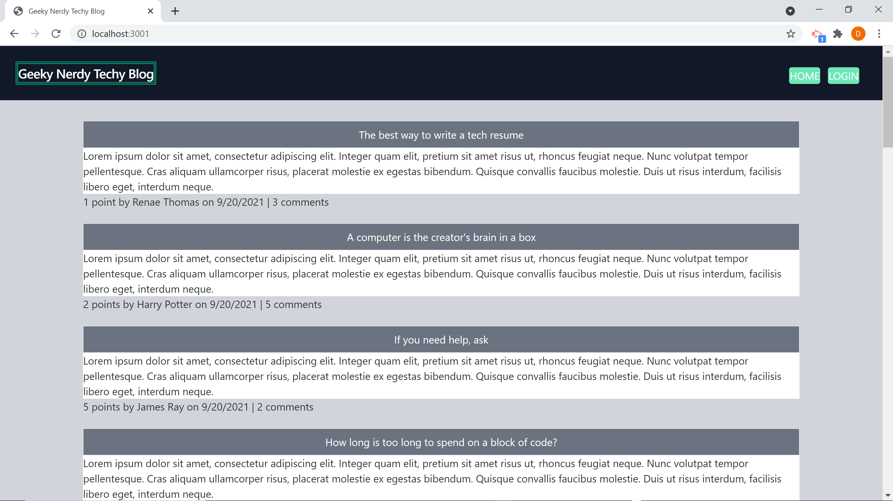
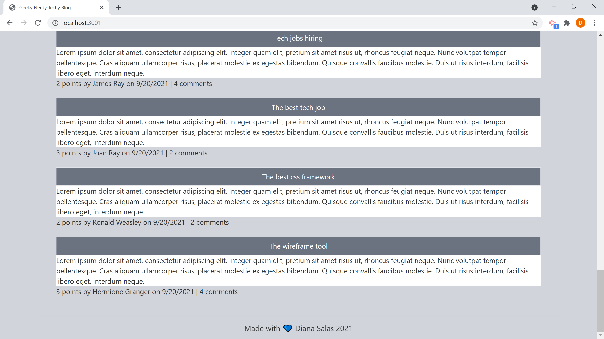
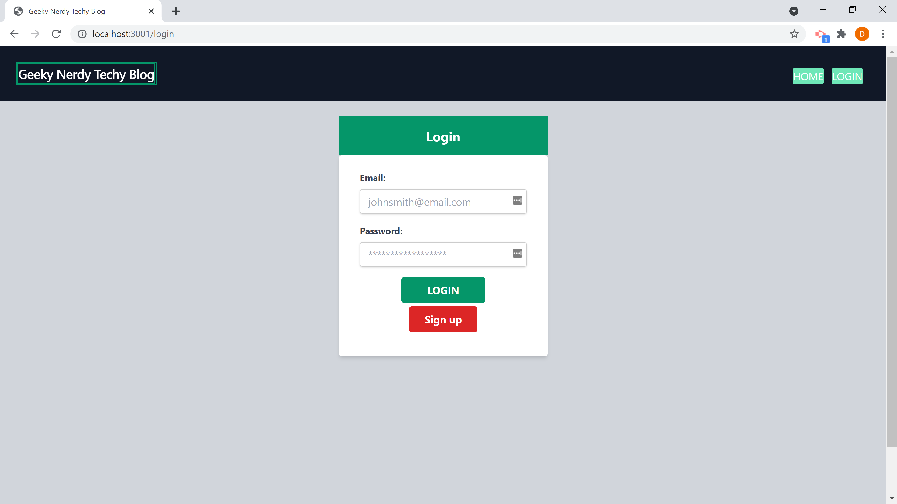
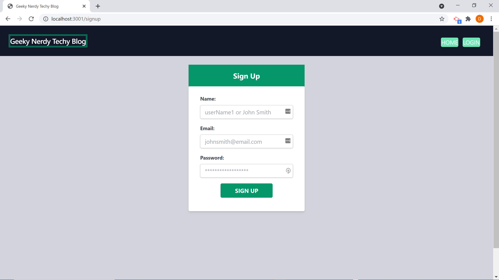
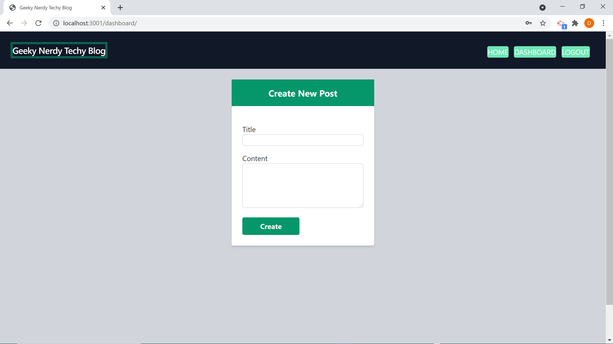
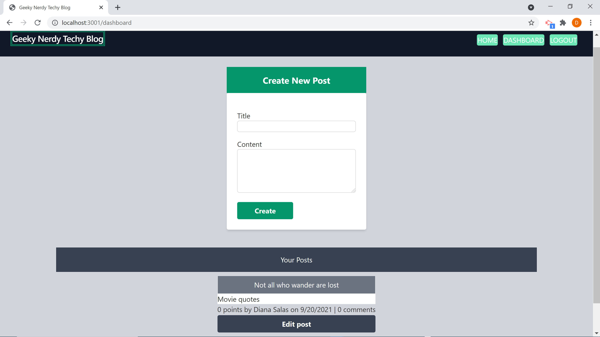
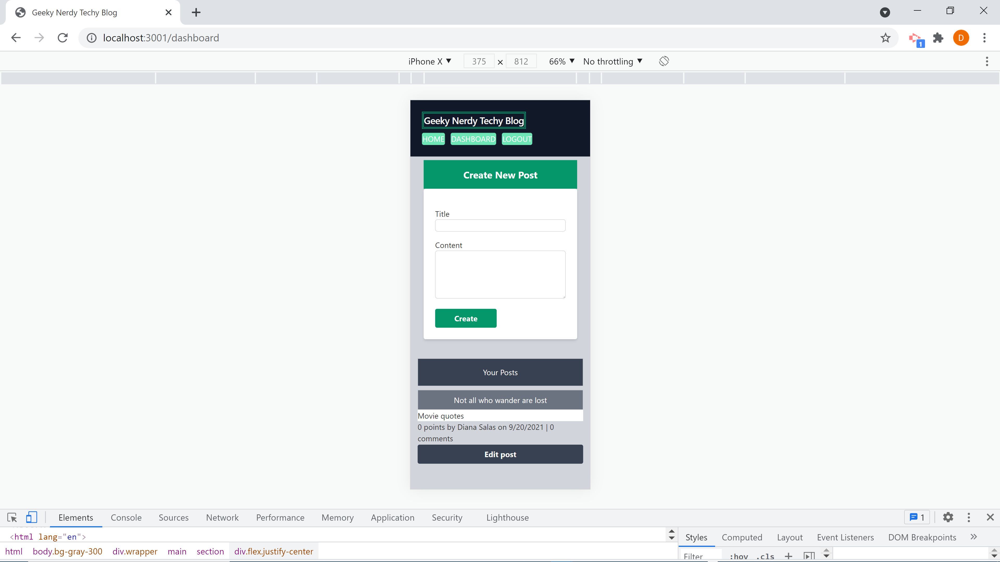

# geeky-nerdy-techy-blog


## Description

For challenge 14 of the UM Coding Bootcamp, I had to create a tech blog using backend api routes, server, and database. I also had to incorporate a user-friendly mobile responsive frontend using handlebars, home routes, and JavaScript. Password encryption was required to successfully store a user to the database. I incorporated new CSS framework, Tailwind, to style the frontend.


## Table of Contents

* [Mock-Up](#mock-up)

* [Built-With](#built-with)

* [Installation](#installation)

* [Usage](#usage)

* [License](#license)

* [Contributing](#contributing)

* [Questions](#questions)

* [Deployed](#deployed)

* [Repository](#repository)


## Mock-Up










## Built-With

Node.js, Express.js, Sequelize, MySQL, JavaScript, Handlebars, CSS, Tailwind CSS Framework, bcrypt


## Installation

To install necessary dependencies, run the following command:
```md
npm i
```

## Usage

To use this application, run the following commands:
```md
mysql -u root -p
---->source db/schema.sql
npm run seed
npm start
```

## License

This project is licensed under the GNU GPLv3 license.


## Contributing

Please contact the owner of the repository if you would like to contribute.


## Questions

If you have any questions about the repo, open an issue or contact me directly at salasd10418@gmail.com. You can find more of my work at [Github](https://github.com/salasd93).


## Deployed

https://geeky-nerdy-techy-blog.herokuapp.com/login


## Repository

https://github.com/SalasD93/geeky-nerdy-techy-blog